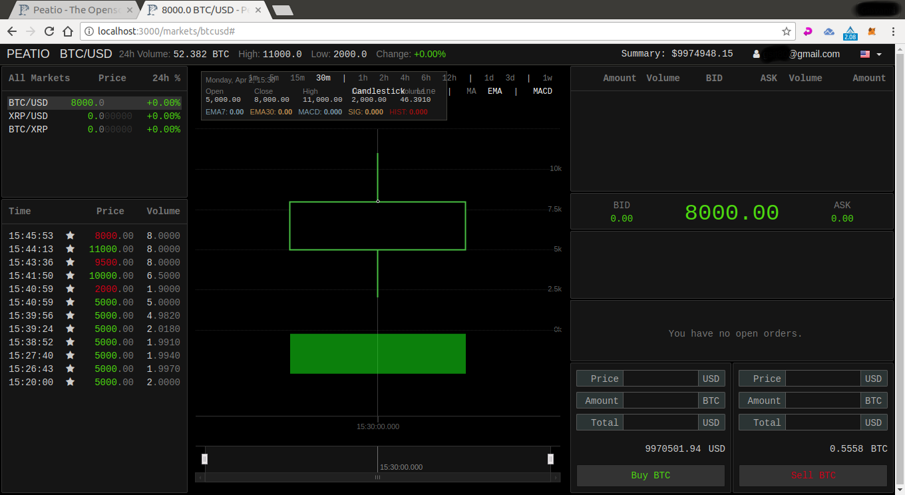

    <section class="container">
        

            

                

                    <h2>The Exchange</h2>
                    

                        The Ripa Exchange is built based on the Open Source code of <a href="https://www.peatio.com">Peatio [貔貅]</a> and thanks to RLSP (Ripa Liquidity Service Provider) each exchange in the RIPA network will share the same orderbook giving exchange managers a liquidity to offer to their end users from day 1.
                    

                

            

        

        

            

                

                    <h3>
                        Open Source
                    </h3>
                    

                        Ripa Exchange is and always will be free of charge for exchange managers: you will have only to pay for server, network security operations, call center operators and other resources needed to run an exchange and give platinum support to your clients.
                    

                    

                        You can make all the customization you want on the source code as all the source base is released under the MIT license.
                    

                    

                        <a class="btn-sm btn-shadow btn-shadow-info" href="/comingSoon">
                            Learn More
                        </a>
                    

                

            

            

                

                    <h3>
                        Bank Grade Security
                    </h3>
                    

                        AES256 encryption keys and all the design of the exchange is build with a focus on security. Ruby on Rails is know to be a secure development environment for developers but we choose to complitely re-modularize the Peatio source base to make complete separation from the clients registry to the trading engine so no end users data will be compromised if the attacker is able to overcame  the first level of security.
                    

                    

                        International AML/KYC standards are in place to secure compliance for your exchange in whichever country you want to install your instance.
                    

                    

                        <a class="btn-sm btn-shadow btn-shadow-info" href="/comingSoon">
                            Learn More
                        </a>
                    

                

            

            

                

                    <h3>
                        Ripa Liquidity Service Provider
                    </h3>
                    

                        RLSP is developed to permits you to have liquidity to offer to your clients from day 1 of your exchanges operation: your new Ripa Exchange instance will interface with the RIPA blockchain* to get all the liqudidy available in the exchanges network.
                    

                    

                        Exchange A that open the order will get 0,10% as transaction fee.
                    

                    

                        * thank you to ACES-ARK technology
                    

                    

                        <a class="btn-sm btn-shadow btn-shadow-info" href="/comingSoon">
                            Learn More
                        </a>
                    

                

            

        

    </section>

    

        <header>
            <h4>Ripa Blockchain Statistics</h4>
        </header>
        

            

                

                    

                        115,000,000
                        
Tokens

                    

                    

                        101
                        
Delegates

                    

                    

                        8 sec.
                        
Forging Time

                    

                    

                        2 XPX
                        
Forging Reward

                    

                

            

        

    

    

        <header>
            <h3>Exchange Features</h3>
        </header>
        <section class="features">
            

                

                    <section class="center">
                        

                            <i class="fab fa-osi fa-4x"></i>
                        

                        <h4>
                            Open Source
                        </h4>
                        

                            Peatio is a customizable cryptocurrency exchange solution architecture enables easy connection to KYC/AML, authentication, ETL/reporting, and other services.
                        

                    </section>
                

                

                    <section class="center">
                        

                            <i class="far fa-id-card fa-4x"></i>
                        

                        <h4>
                            KYC Verification
                        </h4>
                        

                            Peatio KYC efficiently submits and exchanges KYC information to meet the banking supervisory standards and comply with Customer Due Diligence (CDD) requirements.
                        

                    </section>
                

                

                    <section class="center">
                        

                            <i class="fas fa-cogs fa-4x"></i>
                        

                        <h4>
                            Transparent & Configurable
                        </h4>
                        

                            Peatio is a true open source technology making it secure, transparent, flexible and highly configurable.
                        

                    </section>
                

                

                    <section class="center">
                        

                            <i class="fas fa-language fa-4x"></i>
                        

                        <h4>
                            Internationalization
                        </h4>
                        

                            Peatio supports a wide array of common languages, while improving usability for users all over the world.
                        

                    </section>
                

            

            

                

                    <section class="center">
                        

                            <i class="fas fa-users fa-4x"></i>
                        

                        <h4>
                            Proof of Solvency
                        </h4>
                        

                            Peatio Proof of Solvency (PoS) allows users to verify the solvency of the Peatio based cryptocurrency exchange without compromising user privacy.
                        

                    </section>
                

                

                    <section class="center">
                        

                            <i class="fas fa-suitcase fa-4x"></i>
                        

                        <h4>
                            Multi-Accounts
                        </h4>
                        

                            Peatio allows to create multiple accounts and trading in multiple currencies. Peatio makes it is easy to trade different currencies.
                        

                    </section>
                

                

                    <section class="center">
                        

                            <i class="fas fa-rocket fa-4x"></i>
                        

                        <h4>
                            Enterprise Exchange
                        </h4>
                        

                            Peatio enterprise exchange features include a high-performance matching engine, scalable distributed worker threads, and SMS 2-factor authentication.
                        

                    </section>
                

                

                    <section class="center">
                        

                            <i class="fas fa-arrows-alt fa-4x"></i>
                        

                        <h4>
                            Functional & Intuitive
                        </h4>
                        

                            Clean, user friendly registration and login interface. Personalized deposit and withdraw procedure and a built-in proof-of-solvency audit.
                        

                    </section>
                

            

        </section>
    

    <section class="clearfix">
        
        <h4>Ripa Exchange Trading Console</h4>
        

            The Ripa Exchange Trading Console is a fully responsive trading UI built with responsive design to save you time and money, while enabling your clients to conveniently access your content on any device.
        

        

            Ripa Exchange specializes in designing beautiful interfaces for content while balancing your application to be consistent as viewport increases.
        

        

            <a class="btn-shadow btn-shadow-info mr-md-1" href="/comingSoon">
                Learn More
            </a>
        

    </section>

    

        

            "Starting an exchange shouldn't be hard, what is hard is to give platinum support to your clients, comply with international regulations and have reliable banking partners to operate with: you should focus on that while the code and liquidity to start your exchanges operations is given to you free of charge."
        

    

    

        <header>
            <h4>Accepting all mayor cryptocurrencies</h4>
        </header>
        

            

                <i class="img-fluid mb-4 cc USDT" title="USDT"></i>
            

            

                <i class="img-fluid mb-4 cc BTC" title="BTC"></i>
            

            

                <i class="img-fluid mb-4 cc BCH" title="BCH"></i>
            

            

                <i class="img-fluid mb-4 cc ETH" title="ETH"></i>
            

            

                <i class="img-fluid mb-4 cc XRP" title="XRP"></i>
            

            

                <i class="img-fluid mb-4 cc LTC" title="LTC"></i>
            

            

                <i class="img-fluid mb-4 cc DOGE" title="DOGE"></i>
            

            

                <i class="img-fluid mb-4 cc ARK" title="ARK"></i>
            

        

        

            

                <i class="img-fluid mb-4 cc STR" title="STR"></i>
            

            

                <i class="img-fluid mb-4 cc RISE" title="RISE"></i>
            

            

                <i class="img-fluid mb-4 cc LSK" title="LSK"></i>
            

            

                <i class="img-fluid mb-4 cc DASH" title="DASH"></i>
            

            

                <i class="img-fluid mb-4 cc XMR" title="XMR"></i>
            

            

                <i class="img-fluid mb-4 cc DGB" title="DGB"></i>
            

            

                <i class="img-fluid mb-4 cc STEEM" title="STEEM"></i>
            

            

                <i class="img-fluid mb-4 cc NEO" title="NEO"></i>
            

        

    

