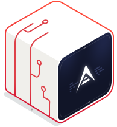
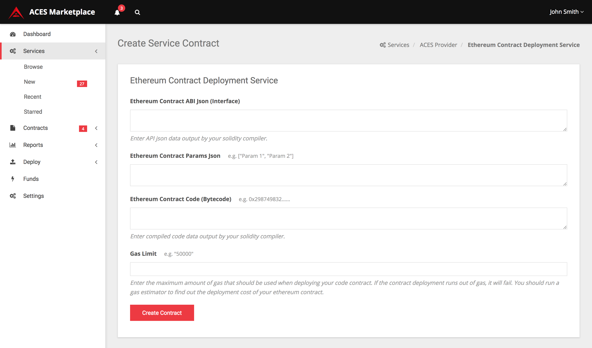

    

        <h2 class="customFadeInUp">
            A blockchain interoperability platform for a new world.
        </h2>
        

            We are building a developer friendly blockchain interoperability platform 
            to unleash the full potential of the crypto revolution.
        

        

            <button class="btn-shadow btn-shadow-info mr-md-1">Watch Intro Video</button>
        

    

  

    

        

        

            <iframe id="youtube_player" class="yt_player_iframe" type="text/html" src="https://www.youtube.com/embed/X94qHbZBYA8?enablejsapi=1&version=3&playerapiid=ytplayer" 
            frameborder="0" allowscriptaccess="always">
            </iframe>
        

      

    

  

    <section class="container">
        

            

                

                    <h2>Blockchain Interoperability Platform</h2>
                    

                        ARK Contract Execution Services (ACES) provides simple protocols and 
                        tools for building a robust blockchain service marketplace.
                    

                

            

        

        

            

                

                    <h3>
                        ACES Listeners
                    </h3>
                    

                        ACES Listeners provide a way for all the different blockchain transaction events 
                        to be easily consumed via a common REST-ful API. The API allows consumers to create 
                        subscriptions and receive blockchain events in real-time using Webhook callbacks.
                    

                    

                        <a class="btn-sm btn-shadow btn-shadow-info" href="listeners">
                            Learn More
                        </a>
                    

                

            

            

                

                    <h3>
                        ACES Services
                    </h3>
                    

                        ACES Services create and excute Service Contracts, which can be anything from uploading a 
                        file to a storage blockchain, 
                        performing value transfers, creating smart contracts, executing code on blockchain based 
                        computing platforms, or interacting with IoT hardware.
                    

                    

                        <a class="btn-sm btn-shadow btn-shadow-info" href="services">
                            Learn More
                        </a>
                    

                

            

            

                

                    <h3>
                        ACES Marketplace Console
                    </h3>
                    

                        The ACES Marketplace Console is a consumer dashboard for searching and executing
                        service contracts listed on the Marketplace.
                        ACES Service providers can list their service nodes using the Marketplace API.
                    

                    

                        <a class="btn-sm btn-shadow btn-shadow-info" href="/marketplace">
                            Learn More
                        </a>
                    

                

            

        

    </section>

    

        <header>
            <h4>Platform Statistics</h4>
        </header>
        

            

                

                    

                        4
                        
Listeners

                    

                    

                        3
                        
Services

                    

                    

                        1
                        
Marketplaces

                    

                    

                        0 BTC
                        
Volume

                    

                

            

        

    

    

        <header>
            <h3>Platform Features</h3>
        </header>
        <section class="features">
            

                

                    
                    <section>
                        <h4>
                            Open Source
                        </h4>
                        

                            Everything on the ACES platform is open source and uses a permissive free software license (MIT).
                        

                    </section>
                

                

                    
                    <section>
                        <h4>
                            REST-ful APIs
                        </h4>
                        

                            The ACES platform uses simple REST-ful APIs for easy integration.
                        

                    </section>
                

            

            

                

                    
                    <section>
                        <h4>
                            Decentrallized
                        </h4>
                        

                            A marketplace platform that allows users to consume blockchain services offered by a 
                            decentralized collection of service providers. 
                        

                    </section>
                

                

                    
                    <section>
                        <h4>
                            Service Composition
                        </h4>
                        

                            Use functional composition to chain ACES Services together.
                        

                    </section>
                

            

            

                

                    
                    <section>
                        <h4>
                            Incentivized
                        </h4>
                        

                            The ACES platform provides an open fee model that allows service providers
                            to compete in a free market.
                        

                    </section>
                

                

                    
                    <section>
                        <h4>
                            Programming Languages
                        </h4>
                        

                            Built using light-weight microservices that are easy for providers
                            to implement in different programming languages and frameworks.
                        

                    </section>
                

            

        </section>
    

    <section class="clearfix">
        

        <h4>ACES Marketplace Console</h4>
        

            The ACES Marketplace Console provides a simple web interface for tapping into available 
            ACES Services listed on the public marketplace directory. An integrated payment wallet allows
            service contracts to be executed and payed for directly though the Marketplace Console.
        

        

            <a class="btn-shadow btn-shadow-info mr-md-1" href="marketplace">
                Learn More
            </a>
        

    </section>

    

        

            "The future will be driven by many thousands of product specific blockchains. It is going to be 
            exceedingly frustrating to consumers if we don’t do something about disconnected blockchains soon, 
            because the technologies are coming around the corner at blazing speeds."
        

    

    

        <h3>Latest Posts</h3>
        

            

                

                    
                    

                        A Future of Cryptocurrencies and Blockchains
                    

                    

                        3 min read
                    

                    

                        What is the real world use case for ACES? The real world use case may not have arrived quite yet, but it’s fast approaching.
                    

                

            

            

                

                    
                    

                        ACES Completes ARK Authentication Listeners for ARK, Bitcoin, Ethereum, and Litecoin
                    

                    

                        4 min read
                    

                    

                        This release is an expansion and improvement to our existing listener protocol, providing high 
                        quality features that will support a robust blockchain service ecosystem. This release also includes
                        deployment of stake-based listeners for ARK and Ethereum, which you can begin using immediately to 
                        build services. We will be deploying two additional listeners for Bitcoin and Litecoin alongside 
                        our release of services in the coming weeks.
                    

                

            

            

                

                    
                    

                        Development of the ARK and Bitcoin Listeners Completed
                    

                    

                        3 min read
                    

                    

                        The listener is the component that plugs into a blockchain (such as Bitcoin) and provides 
                        standardized API access for ARK services to receive data from a blockchain. The listener stands 
                        on its own, and does not necessarily need to be run by the same person running a service.
                    

                

            

        

    

    

        <header>
            <h4>Connecting the best blockchain technologies</h4>
        </header>
        

            

                <i class="img-fluid mb-4 cc ARK" title="ARK"></i>
            

            

                <i class="img-fluid mb-4 cc BTC" title="BTC"></i>
            

            

                <i class="img-fluid mb-4 cc LTC" title="LTC"></i>
            

            

                <i class="img-fluid mb-4 cc XMR" title="XMR"></i>
            

            

                <i class="img-fluid mb-4 cc ETH" title="ETH"></i>
            

            

                <i class="img-fluid mb-4 cc IOTA" title="IOTA"></i>
            

            

                <i class="img-fluid mb-4 cc NEO" title="NEO"></i>
            

            

                <i class="img-fluid mb-4 cc SIA" title="SIA"></i>
            

            

                <i class="img-fluid mb-4 cc GNT" title="GNT"></i>
            

        

    

