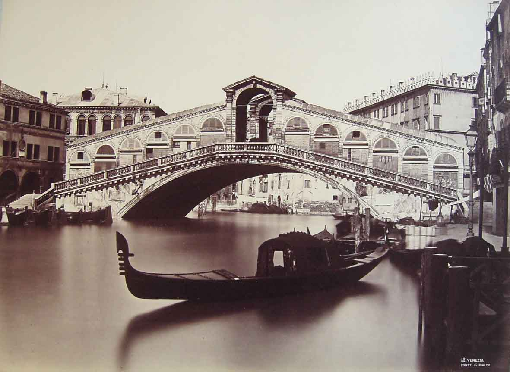

    <section class="container">
        

            

                

                    <h2>Team</h2>
                

                  

                    

                      
 
  
                      <b>Luca Dordolo </b>  ADVISOR 
                        
                      <a href="https://bitcointalk.org/index.php?topic=327894.0" target="blank"><svg class="svg-inline--fa fa-bitcoin fa-w-16 fa-2x" aria-hidden="true" data-prefix="fab" data-icon="bitcoin" role="img" xmlns="http://www.w3.org/2000/svg" viewBox="0 0 512 512" data-fa-i2svg=""><path fill="currentColor" d="M504 256c0 136.967-111.033 248-248 248S8 392.967 8 256 119.033 8 256 8s248 111.033 248 248zm-141.651-35.33c4.937-32.999-20.191-50.739-54.55-62.573l11.146-44.702-27.213-6.781-10.851 43.524c-7.154-1.783-14.502-3.464-21.803-5.13l10.929-43.81-27.198-6.781-11.153 44.686c-5.922-1.349-11.735-2.682-17.377-4.084l.031-.14-37.53-9.37-7.239 29.062s20.191 4.627 19.765 4.913c11.022 2.751 13.014 10.044 12.68 15.825l-12.696 50.925c.76.194 1.744.473 2.829.907-.907-.225-1.876-.473-2.876-.713l-17.796 71.338c-1.349 3.348-4.767 8.37-12.471 6.464.271.395-19.78-4.937-19.78-4.937l-13.51 31.147 35.414 8.827c6.588 1.651 13.045 3.379 19.4 5.006l-11.262 45.213 27.182 6.781 11.153-44.733a1038.209 1038.209 0 0 0 21.687 5.627l-11.115 44.523 27.213 6.781 11.262-45.128c46.404 8.781 81.299 5.239 95.986-36.727 11.836-33.79-.589-53.281-25.004-65.991 17.78-4.098 31.174-15.792 34.747-39.949zm-62.177 87.179c-8.41 33.79-65.308 15.523-83.755 10.943l14.944-59.899c18.446 4.603 77.6 13.717 68.811 48.956zm8.417-87.667c-7.673 30.736-55.031 15.12-70.393 11.292l13.548-54.327c15.363 3.828 64.836 10.973 56.845 43.035z"></path></svg><!-- <i class="fab fa-2x fa-bitcoin"></i> --></a>

                      <a href="https://t.me/gavrilobtc" target="blank"><svg class="svg-inline--fa fa-telegram fa-w-16 fa-2x" aria-hidden="true" data-prefix="fab" data-icon="telegram" role="img" xmlns="http://www.w3.org/2000/svg" viewBox="0 0 496 512" data-fa-i2svg=""><path fill="currentColor" d="M248 8C111 8 0 119 0 256s111 248 248 248 248-111 248-248S385 8 248 8zm121.8 169.9l-40.7 191.8c-3 13.6-11.1 16.9-22.4 10.5l-62-45.7-29.9 28.8c-3.3 3.3-6.1 6.1-12.5 6.1l4.4-63.1 114.9-103.8c5-4.4-1.1-6.9-7.7-2.5l-142 89.4-61.2-19.1c-13.3-4.2-13.6-13.3 2.8-19.7l239.1-92.2c11.1-4 20.8 2.7 17.2 19.5z"></path></svg><!-- <i class="fab fa-2x fa-telegram"></i> --></a>
                      <a href="http://www.gavrilobtc.it/" target="blank"><svg class="svg-inline--fa fa-link fa-w-16 fa-2x" aria-hidden="true" data-prefix="fas" data-icon="link" role="img" xmlns="http://www.w3.org/2000/svg" viewBox="0 0 512 512" data-fa-i2svg=""><path fill="currentColor" d="M326.612 185.391c59.747 59.809 58.927 155.698.36 214.59-.11.12-.24.25-.36.37l-67.2 67.2c-59.27 59.27-155.699 59.262-214.96 0-59.27-59.26-59.27-155.7 0-214.96l37.106-37.106c9.84-9.84 26.786-3.3 27.294 10.606.648 17.722 3.826 35.527 9.69 52.721 1.986 5.822.567 12.262-3.783 16.612l-13.087 13.087c-28.026 28.026-28.905 73.66-1.155 101.96 28.024 28.579 74.086 28.749 102.325.51l67.2-67.19c28.191-28.191 28.073-73.757 0-101.83-3.701-3.694-7.429-6.564-10.341-8.569a16.037 16.037 0 0 1-6.947-12.606c-.396-10.567 3.348-21.456 11.698-29.806l21.054-21.055c5.521-5.521 14.182-6.199 20.584-1.731a152.482 152.482 0 0 1 20.522 17.197zM467.547 44.449c-59.261-59.262-155.69-59.27-214.96 0l-67.2 67.2c-.12.12-.25.25-.36.37-58.566 58.892-59.387 154.781.36 214.59a152.454 152.454 0 0 0 20.521 17.196c6.402 4.468 15.064 3.789 20.584-1.731l21.054-21.055c8.35-8.35 12.094-19.239 11.698-29.806a16.037 16.037 0 0 0-6.947-12.606c-2.912-2.005-6.64-4.875-10.341-8.569-28.073-28.073-28.191-73.639 0-101.83l67.2-67.19c28.239-28.239 74.3-28.069 102.325.51 27.75 28.3 26.872 73.934-1.155 101.96l-13.087 13.087c-4.35 4.35-5.769 10.79-3.783 16.612 5.864 17.194 9.042 34.999 9.69 52.721.509 13.906 17.454 20.446 27.294 10.606l37.106-37.106c59.271-59.259 59.271-155.699.001-214.959z"></path></svg><!-- <i class="fas fa-2x fa-link"></i> --></a>

                    

                    

                      
  
                      <b>Giovanni silvestri </b>  FOUNDER AND CEO 

                        
                      <a href="" target="blank"><svg class="svg-inline--fa fa-bitcoin fa-w-16 fa-2x" aria-hidden="true" data-prefix="fab" data-icon="bitcoin" role="img" xmlns="http://www.w3.org/2000/svg" viewBox="0 0 512 512" data-fa-i2svg=""><path fill="currentColor" d="M504 256c0 136.967-111.033 248-248 248S8 392.967 8 256 119.033 8 256 8s248 111.033 248 248zm-141.651-35.33c4.937-32.999-20.191-50.739-54.55-62.573l11.146-44.702-27.213-6.781-10.851 43.524c-7.154-1.783-14.502-3.464-21.803-5.13l10.929-43.81-27.198-6.781-11.153 44.686c-5.922-1.349-11.735-2.682-17.377-4.084l.031-.14-37.53-9.37-7.239 29.062s20.191 4.627 19.765 4.913c11.022 2.751 13.014 10.044 12.68 15.825l-12.696 50.925c.76.194 1.744.473 2.829.907-.907-.225-1.876-.473-2.876-.713l-17.796 71.338c-1.349 3.348-4.767 8.37-12.471 6.464.271.395-19.78-4.937-19.78-4.937l-13.51 31.147 35.414 8.827c6.588 1.651 13.045 3.379 19.4 5.006l-11.262 45.213 27.182 6.781 11.153-44.733a1038.209 1038.209 0 0 0 21.687 5.627l-11.115 44.523 27.213 6.781 11.262-45.128c46.404 8.781 81.299 5.239 95.986-36.727 11.836-33.79-.589-53.281-25.004-65.991 17.78-4.098 31.174-15.792 34.747-39.949zm-62.177 87.179c-8.41 33.79-65.308 15.523-83.755 10.943l14.944-59.899c18.446 4.603 77.6 13.717 68.811 48.956zm8.417-87.667c-7.673 30.736-55.031 15.12-70.393 11.292l13.548-54.327c15.363 3.828 64.836 10.973 56.845 43.035z"></path></svg><!-- <i class="fab fa-2x fa-bitcoin"></i> --></a>
                      <a href="" target="blank"><svg class="svg-inline--fa fa-telegram fa-w-16 fa-2x" aria-hidden="true" data-prefix="fab" data-icon="telegram" role="img" xmlns="http://www.w3.org/2000/svg" viewBox="0 0 496 512" data-fa-i2svg=""><path fill="currentColor" d="M248 8C111 8 0 119 0 256s111 248 248 248 248-111 248-248S385 8 248 8zm121.8 169.9l-40.7 191.8c-3 13.6-11.1 16.9-22.4 10.5l-62-45.7-29.9 28.8c-3.3 3.3-6.1 6.1-12.5 6.1l4.4-63.1 114.9-103.8c5-4.4-1.1-6.9-7.7-2.5l-142 89.4-61.2-19.1c-13.3-4.2-13.6-13.3 2.8-19.7l239.1-92.2c11.1-4 20.8 2.7 17.2 19.5z"></path></svg><!-- <i class="fab fa-2x fa-telegram"></i> --></a>
                      <a href="" target="blank"><svg class="svg-inline--fa fa-linkedin-in fa-w-14 fa-2x" aria-hidden="true" data-prefix="fab" data-icon="linkedin-in" role="img" xmlns="http://www.w3.org/2000/svg" viewBox="0 0 448 512" data-fa-i2svg=""><path fill="currentColor" d="M100.3 480H7.4V180.9h92.9V480zM53.8 140.1C24.1 140.1 0 115.5 0 85.8 0 56.1 24.1 32 53.8 32c29.7 0 53.8 24.1 53.8 53.8 0 29.7-24.1 54.3-53.8 54.3zM448 480h-92.7V334.4c0-34.7-.7-79.2-48.3-79.2-48.3 0-55.7 37.7-55.7 76.7V480h-92.8V180.9h89.1v40.8h1.3c12.4-23.5 42.7-48.3 87.9-48.3 94 0 111.3 61.9 111.3 142.3V480z"></path></svg><!-- <i class="fab fa-2x fa-linkedin-in"></i> --></a> 

                    

                    

                      
 
  
                      <b>Giorgio Isola </b>  FOUNDER AND CDO

                        
                      <a href="" target="blank"><svg class="svg-inline--fa fa-bitcoin fa-w-16 fa-2x" aria-hidden="true" data-prefix="fab" data-icon="bitcoin" role="img" xmlns="http://www.w3.org/2000/svg" viewBox="0 0 512 512" data-fa-i2svg=""><path fill="currentColor" d="M504 256c0 136.967-111.033 248-248 248S8 392.967 8 256 119.033 8 256 8s248 111.033 248 248zm-141.651-35.33c4.937-32.999-20.191-50.739-54.55-62.573l11.146-44.702-27.213-6.781-10.851 43.524c-7.154-1.783-14.502-3.464-21.803-5.13l10.929-43.81-27.198-6.781-11.153 44.686c-5.922-1.349-11.735-2.682-17.377-4.084l.031-.14-37.53-9.37-7.239 29.062s20.191 4.627 19.765 4.913c11.022 2.751 13.014 10.044 12.68 15.825l-12.696 50.925c.76.194 1.744.473 2.829.907-.907-.225-1.876-.473-2.876-.713l-17.796 71.338c-1.349 3.348-4.767 8.37-12.471 6.464.271.395-19.78-4.937-19.78-4.937l-13.51 31.147 35.414 8.827c6.588 1.651 13.045 3.379 19.4 5.006l-11.262 45.213 27.182 6.781 11.153-44.733a1038.209 1038.209 0 0 0 21.687 5.627l-11.115 44.523 27.213 6.781 11.262-45.128c46.404 8.781 81.299 5.239 95.986-36.727 11.836-33.79-.589-53.281-25.004-65.991 17.78-4.098 31.174-15.792 34.747-39.949zm-62.177 87.179c-8.41 33.79-65.308 15.523-83.755 10.943l14.944-59.899c18.446 4.603 77.6 13.717 68.811 48.956zm8.417-87.667c-7.673 30.736-55.031 15.12-70.393 11.292l13.548-54.327c15.363 3.828 64.836 10.973 56.845 43.035z"></path></svg><!-- <i class="fab fa-2x fa-bitcoin"></i> --></a>
                      <a href="" target="blank"><svg class="svg-inline--fa fa-telegram fa-w-16 fa-2x" aria-hidden="true" data-prefix="fab" data-icon="telegram" role="img" xmlns="http://www.w3.org/2000/svg" viewBox="0 0 496 512" data-fa-i2svg=""><path fill="currentColor" d="M248 8C111 8 0 119 0 256s111 248 248 248 248-111 248-248S385 8 248 8zm121.8 169.9l-40.7 191.8c-3 13.6-11.1 16.9-22.4 10.5l-62-45.7-29.9 28.8c-3.3 3.3-6.1 6.1-12.5 6.1l4.4-63.1 114.9-103.8c5-4.4-1.1-6.9-7.7-2.5l-142 89.4-61.2-19.1c-13.3-4.2-13.6-13.3 2.8-19.7l239.1-92.2c11.1-4 20.8 2.7 17.2 19.5z"></path></svg><!-- <i class="fab fa-2x fa-telegram"></i> --></a>
                      <a href="" target="blank"><svg class="svg-inline--fa fa-linkedin-in fa-w-14 fa-2x" aria-hidden="true" data-prefix="fab" data-icon="linkedin-in" role="img" xmlns="http://www.w3.org/2000/svg" viewBox="0 0 448 512" data-fa-i2svg=""><path fill="currentColor" d="M100.3 480H7.4V180.9h92.9V480zM53.8 140.1C24.1 140.1 0 115.5 0 85.8 0 56.1 24.1 32 53.8 32c29.7 0 53.8 24.1 53.8 53.8 0 29.7-24.1 54.3-53.8 54.3zM448 480h-92.7V334.4c0-34.7-.7-79.2-48.3-79.2-48.3 0-55.7 37.7-55.7 76.7V480h-92.8V180.9h89.1v40.8h1.3c12.4-23.5 42.7-48.3 87.9-48.3 94 0 111.3 61.9 111.3 142.3V480z"></path></svg><!-- <i class="fab fa-2x fa-linkedin-in"></i> --></a>

                    

                    

                      
 
  
                      <b>Giorgio Isola </b>  FOUNDER AND CDO  10+ years experience in design.   4+ years in cryptocurrencies consultancy and exchanging.  Location: Milan (MI), Italy

                        
                      <a href="" target="blank"><svg class="svg-inline--fa fa-bitcoin fa-w-16 fa-2x" aria-hidden="true" data-prefix="fab" data-icon="bitcoin" role="img" xmlns="http://www.w3.org/2000/svg" viewBox="0 0 512 512" data-fa-i2svg=""><path fill="currentColor" d="M504 256c0 136.967-111.033 248-248 248S8 392.967 8 256 119.033 8 256 8s248 111.033 248 248zm-141.651-35.33c4.937-32.999-20.191-50.739-54.55-62.573l11.146-44.702-27.213-6.781-10.851 43.524c-7.154-1.783-14.502-3.464-21.803-5.13l10.929-43.81-27.198-6.781-11.153 44.686c-5.922-1.349-11.735-2.682-17.377-4.084l.031-.14-37.53-9.37-7.239 29.062s20.191 4.627 19.765 4.913c11.022 2.751 13.014 10.044 12.68 15.825l-12.696 50.925c.76.194 1.744.473 2.829.907-.907-.225-1.876-.473-2.876-.713l-17.796 71.338c-1.349 3.348-4.767 8.37-12.471 6.464.271.395-19.78-4.937-19.78-4.937l-13.51 31.147 35.414 8.827c6.588 1.651 13.045 3.379 19.4 5.006l-11.262 45.213 27.182 6.781 11.153-44.733a1038.209 1038.209 0 0 0 21.687 5.627l-11.115 44.523 27.213 6.781 11.262-45.128c46.404 8.781 81.299 5.239 95.986-36.727 11.836-33.79-.589-53.281-25.004-65.991 17.78-4.098 31.174-15.792 34.747-39.949zm-62.177 87.179c-8.41 33.79-65.308 15.523-83.755 10.943l14.944-59.899c18.446 4.603 77.6 13.717 68.811 48.956zm8.417-87.667c-7.673 30.736-55.031 15.12-70.393 11.292l13.548-54.327c15.363 3.828 64.836 10.973 56.845 43.035z"></path></svg><!-- <i class="fab fa-2x fa-bitcoin"></i> --></a>
                      <a href="" target="blank"><svg class="svg-inline--fa fa-telegram fa-w-16 fa-2x" aria-hidden="true" data-prefix="fab" data-icon="telegram" role="img" xmlns="http://www.w3.org/2000/svg" viewBox="0 0 496 512" data-fa-i2svg=""><path fill="currentColor" d="M248 8C111 8 0 119 0 256s111 248 248 248 248-111 248-248S385 8 248 8zm121.8 169.9l-40.7 191.8c-3 13.6-11.1 16.9-22.4 10.5l-62-45.7-29.9 28.8c-3.3 3.3-6.1 6.1-12.5 6.1l4.4-63.1 114.9-103.8c5-4.4-1.1-6.9-7.7-2.5l-142 89.4-61.2-19.1c-13.3-4.2-13.6-13.3 2.8-19.7l239.1-92.2c11.1-4 20.8 2.7 17.2 19.5z"></path></svg><!-- <i class="fab fa-2x fa-telegram"></i> --></a>
                      <a href="" target="blank"><svg class="svg-inline--fa fa-linkedin-in fa-w-14 fa-2x" aria-hidden="true" data-prefix="fab" data-icon="linkedin-in" role="img" xmlns="http://www.w3.org/2000/svg" viewBox="0 0 448 512" data-fa-i2svg=""><path fill="currentColor" d="M100.3 480H7.4V180.9h92.9V480zM53.8 140.1C24.1 140.1 0 115.5 0 85.8 0 56.1 24.1 32 53.8 32c29.7 0 53.8 24.1 53.8 53.8 0 29.7-24.1 54.3-53.8 54.3zM448 480h-92.7V334.4c0-34.7-.7-79.2-48.3-79.2-48.3 0-55.7 37.7-55.7 76.7V480h-92.8V180.9h89.1v40.8h1.3c12.4-23.5 42.7-48.3 87.9-48.3 94 0 111.3 61.9 111.3 142.3V480z"></path></svg><!-- <i class="fab fa-2x fa-linkedin-in"></i> --></a>

                    

                    

                      
 
  
                      <b>Giorgio Isola </b>  FOUNDER AND CDO  10+ years experience in design.   4+ years in cryptocurrencies consultancy and exchanging.  Location: Milan (MI), Italy

                        
                      <a href="" target="blank"><svg class="svg-inline--fa fa-bitcoin fa-w-16 fa-2x" aria-hidden="true" data-prefix="fab" data-icon="bitcoin" role="img" xmlns="http://www.w3.org/2000/svg" viewBox="0 0 512 512" data-fa-i2svg=""><path fill="currentColor" d="M504 256c0 136.967-111.033 248-248 248S8 392.967 8 256 119.033 8 256 8s248 111.033 248 248zm-141.651-35.33c4.937-32.999-20.191-50.739-54.55-62.573l11.146-44.702-27.213-6.781-10.851 43.524c-7.154-1.783-14.502-3.464-21.803-5.13l10.929-43.81-27.198-6.781-11.153 44.686c-5.922-1.349-11.735-2.682-17.377-4.084l.031-.14-37.53-9.37-7.239 29.062s20.191 4.627 19.765 4.913c11.022 2.751 13.014 10.044 12.68 15.825l-12.696 50.925c.76.194 1.744.473 2.829.907-.907-.225-1.876-.473-2.876-.713l-17.796 71.338c-1.349 3.348-4.767 8.37-12.471 6.464.271.395-19.78-4.937-19.78-4.937l-13.51 31.147 35.414 8.827c6.588 1.651 13.045 3.379 19.4 5.006l-11.262 45.213 27.182 6.781 11.153-44.733a1038.209 1038.209 0 0 0 21.687 5.627l-11.115 44.523 27.213 6.781 11.262-45.128c46.404 8.781 81.299 5.239 95.986-36.727 11.836-33.79-.589-53.281-25.004-65.991 17.78-4.098 31.174-15.792 34.747-39.949zm-62.177 87.179c-8.41 33.79-65.308 15.523-83.755 10.943l14.944-59.899c18.446 4.603 77.6 13.717 68.811 48.956zm8.417-87.667c-7.673 30.736-55.031 15.12-70.393 11.292l13.548-54.327c15.363 3.828 64.836 10.973 56.845 43.035z"></path></svg><!-- <i class="fab fa-2x fa-bitcoin"></i> --></a>
                      <a href="" target="blank"><svg class="svg-inline--fa fa-telegram fa-w-16 fa-2x" aria-hidden="true" data-prefix="fab" data-icon="telegram" role="img" xmlns="http://www.w3.org/2000/svg" viewBox="0 0 496 512" data-fa-i2svg=""><path fill="currentColor" d="M248 8C111 8 0 119 0 256s111 248 248 248 248-111 248-248S385 8 248 8zm121.8 169.9l-40.7 191.8c-3 13.6-11.1 16.9-22.4 10.5l-62-45.7-29.9 28.8c-3.3 3.3-6.1 6.1-12.5 6.1l4.4-63.1 114.9-103.8c5-4.4-1.1-6.9-7.7-2.5l-142 89.4-61.2-19.1c-13.3-4.2-13.6-13.3 2.8-19.7l239.1-92.2c11.1-4 20.8 2.7 17.2 19.5z"></path></svg><!-- <i class="fab fa-2x fa-telegram"></i> --></a>
                      <a href="" target="blank"><svg class="svg-inline--fa fa-linkedin-in fa-w-14 fa-2x" aria-hidden="true" data-prefix="fab" data-icon="linkedin-in" role="img" xmlns="http://www.w3.org/2000/svg" viewBox="0 0 448 512" data-fa-i2svg=""><path fill="currentColor" d="M100.3 480H7.4V180.9h92.9V480zM53.8 140.1C24.1 140.1 0 115.5 0 85.8 0 56.1 24.1 32 53.8 32c29.7 0 53.8 24.1 53.8 53.8 0 29.7-24.1 54.3-53.8 54.3zM448 480h-92.7V334.4c0-34.7-.7-79.2-48.3-79.2-48.3 0-55.7 37.7-55.7 76.7V480h-92.8V180.9h89.1v40.8h1.3c12.4-23.5 42.7-48.3 87.9-48.3 94 0 111.3 61.9 111.3 142.3V480z"></path></svg><!-- <i class="fab fa-2x fa-linkedin-in"></i> --></a>

                    

                    

                      
 
  
                      <b>Giorgio Isola </b>  FOUNDER AND CDO  10+ years experience in design.   4+ years in cryptocurrencies consultancy and exchanging.  Location: Milan (MI), Italy

                        
                      <a href="" target="blank"><svg class="svg-inline--fa fa-bitcoin fa-w-16 fa-2x" aria-hidden="true" data-prefix="fab" data-icon="bitcoin" role="img" xmlns="http://www.w3.org/2000/svg" viewBox="0 0 512 512" data-fa-i2svg=""><path fill="currentColor" d="M504 256c0 136.967-111.033 248-248 248S8 392.967 8 256 119.033 8 256 8s248 111.033 248 248zm-141.651-35.33c4.937-32.999-20.191-50.739-54.55-62.573l11.146-44.702-27.213-6.781-10.851 43.524c-7.154-1.783-14.502-3.464-21.803-5.13l10.929-43.81-27.198-6.781-11.153 44.686c-5.922-1.349-11.735-2.682-17.377-4.084l.031-.14-37.53-9.37-7.239 29.062s20.191 4.627 19.765 4.913c11.022 2.751 13.014 10.044 12.68 15.825l-12.696 50.925c.76.194 1.744.473 2.829.907-.907-.225-1.876-.473-2.876-.713l-17.796 71.338c-1.349 3.348-4.767 8.37-12.471 6.464.271.395-19.78-4.937-19.78-4.937l-13.51 31.147 35.414 8.827c6.588 1.651 13.045 3.379 19.4 5.006l-11.262 45.213 27.182 6.781 11.153-44.733a1038.209 1038.209 0 0 0 21.687 5.627l-11.115 44.523 27.213 6.781 11.262-45.128c46.404 8.781 81.299 5.239 95.986-36.727 11.836-33.79-.589-53.281-25.004-65.991 17.78-4.098 31.174-15.792 34.747-39.949zm-62.177 87.179c-8.41 33.79-65.308 15.523-83.755 10.943l14.944-59.899c18.446 4.603 77.6 13.717 68.811 48.956zm8.417-87.667c-7.673 30.736-55.031 15.12-70.393 11.292l13.548-54.327c15.363 3.828 64.836 10.973 56.845 43.035z"></path></svg><!-- <i class="fab fa-2x fa-bitcoin"></i> --></a>
                      <a href="" target="blank"><svg class="svg-inline--fa fa-telegram fa-w-16 fa-2x" aria-hidden="true" data-prefix="fab" data-icon="telegram" role="img" xmlns="http://www.w3.org/2000/svg" viewBox="0 0 496 512" data-fa-i2svg=""><path fill="currentColor" d="M248 8C111 8 0 119 0 256s111 248 248 248 248-111 248-248S385 8 248 8zm121.8 169.9l-40.7 191.8c-3 13.6-11.1 16.9-22.4 10.5l-62-45.7-29.9 28.8c-3.3 3.3-6.1 6.1-12.5 6.1l4.4-63.1 114.9-103.8c5-4.4-1.1-6.9-7.7-2.5l-142 89.4-61.2-19.1c-13.3-4.2-13.6-13.3 2.8-19.7l239.1-92.2c11.1-4 20.8 2.7 17.2 19.5z"></path></svg><!-- <i class="fab fa-2x fa-telegram"></i> --></a>
                      <a href="" target="blank"><svg class="svg-inline--fa fa-linkedin-in fa-w-14 fa-2x" aria-hidden="true" data-prefix="fab" data-icon="linkedin-in" role="img" xmlns="http://www.w3.org/2000/svg" viewBox="0 0 448 512" data-fa-i2svg=""><path fill="currentColor" d="M100.3 480H7.4V180.9h92.9V480zM53.8 140.1C24.1 140.1 0 115.5 0 85.8 0 56.1 24.1 32 53.8 32c29.7 0 53.8 24.1 53.8 53.8 0 29.7-24.1 54.3-53.8 54.3zM448 480h-92.7V334.4c0-34.7-.7-79.2-48.3-79.2-48.3 0-55.7 37.7-55.7 76.7V480h-92.8V180.9h89.1v40.8h1.3c12.4-23.5 42.7-48.3 87.9-48.3 94 0 111.3 61.9 111.3 142.3V480z"></path></svg><!-- <i class="fab fa-2x fa-linkedin-in"></i> --></a>

                    

                  

                

            

        

    </section>

